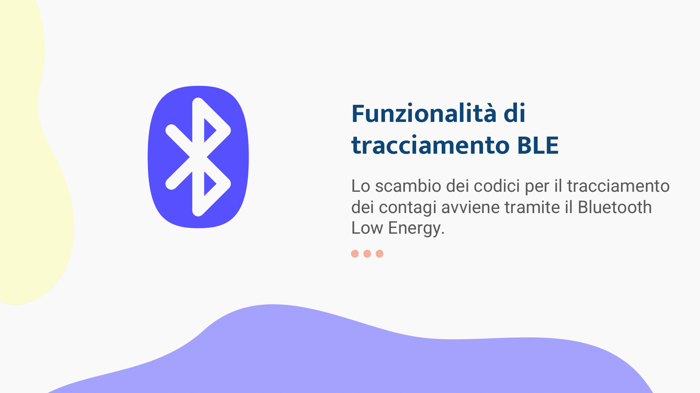

# Savent_Documentation
Repository with all the documentation for the SMS (Sviluppo di Mobile Software) exam project.

## Authors 
* Vitandrea Sorino aka [Vita98](https://github.com/Vita98 "Vita98's profile")
* Francesco Tritto aka [zHold3n](https://github.com/zHold3n "zHold3n's profile")
* Vincenzo Noia aka [VincenzoNo](https://github.com/VincenzoNo "VincenzoNo's profile")
* Sara Scarcelli aka [sara946](https://github.com/sara946 "sara946's profile")

#### Presentation

